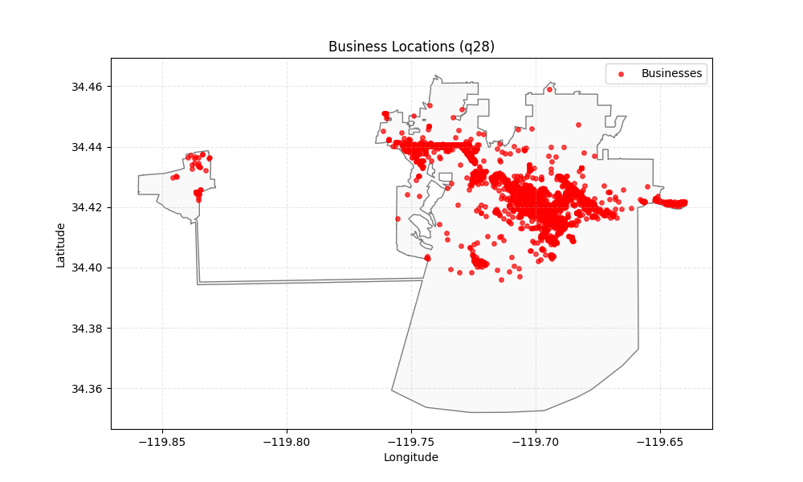
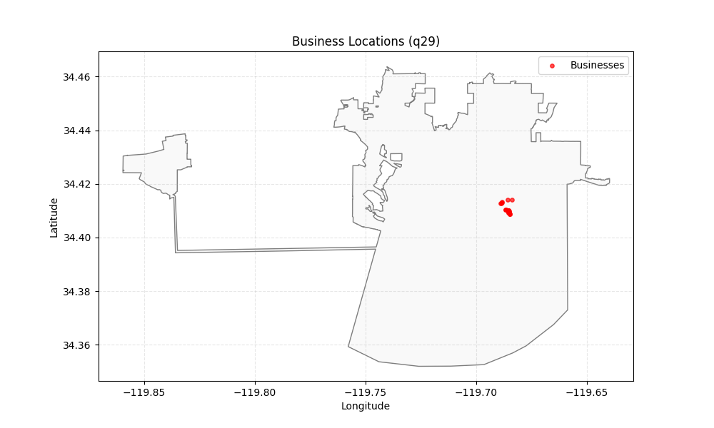
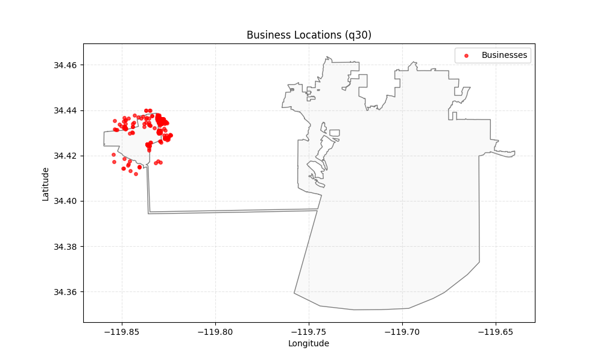

# Yelp Business Analytics with MongoDB

Loads a Yelp business dataset into MongoDB and analyzes it with the MongoDB Query Language: filters and projections, aggregation pipelines, cross-collection joins, and geospatial queries that are plotted on maps of Santa Barbara, CA.

## Highlights

- **Ingestion**: newline-delimited JSON goes into four collections: `businesses`, `reviews`, `tips`, `users`.
- **Querying**: filters on city, star rating, category (regex), postal code, and nested attributes such as wheelchair accessibility, with projections, sorting, and limits.
- **Aggregation pipelines**: `$match`, `$group`, `$split`, `$unwind`, and `$sort` produce category-level counts, average ratings, and user-activity metrics (distinct businesses reviewed, total reviews).
- **Joins**: `$lookup` combines businesses with their reviews to summarize positive vs. negative review volume per business.
- **Geospatial**: a `2dsphere` index backs three map queries:
  - `$geoWithin` against the Santa Barbara city boundary (GeoJSON polygon)
  - `$near` the Stearns Wharf pier
  - `$centerSphere` around Santa Barbara Airport

| Businesses inside city limits | Nearest to Stearns Wharf | Around SB Airport |
| --- | --- | --- |
|  |  |  |

## Tech stack

MongoDB · PyMongo · pandas · GeoPandas · Shapely · matplotlib · Jupyter

## Project structure

```text
Yelp-MongoDB-Geospatial-Analytics/
├── yelp_mongodb_analysis.ipynb     # all queries, pipelines, and maps
├── santa_barbara_limits.geojson    # city boundary polygon
├── map_*.png                       # rendered geospatial query results
└── requirements.txt
```

## Running locally

```bash
# 1. MongoDB
docker run --name mongodb -d -p 127.0.0.1:27017:27017 mongo

# 2. Python deps
pip install -r requirements.txt

# 3. Data: put the Yelp sample JSON files (businesses/reviews/tips/users)
#    in ./yelp_ca_sample/  (a California subset of the Yelp Open Dataset)

jupyter lab yelp_mongodb_analysis.ipynb
```

The raw Yelp data isn't committed; see the [Yelp Open Dataset](https://www.yelp.com/dataset) and its terms.
